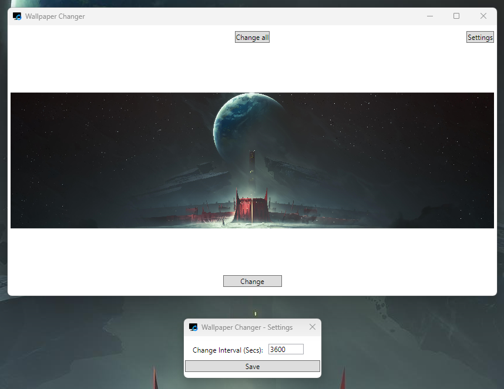
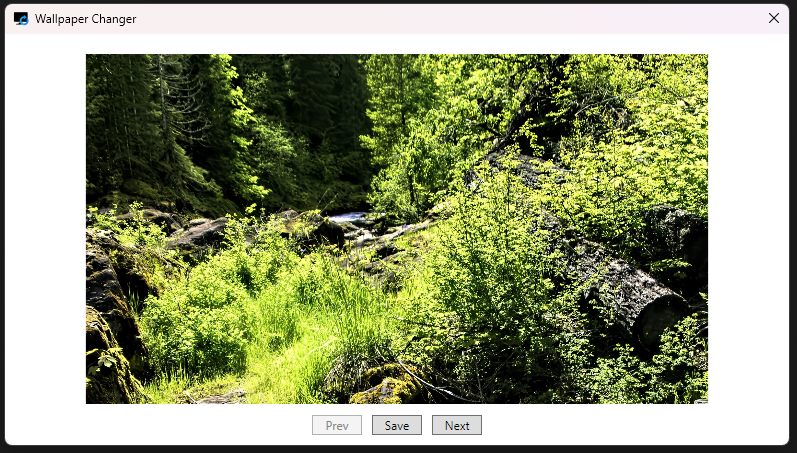

# Wallpaper Changer
This is a little tool which frequently changes your wallpaper in a given interval. 

:warning: **It's a windows only tool!**

Main GUI

New images GUI

## Features
- Detect all screens 
- Change image for one screen (via GUI)
- Change image for all screens (via GUI and Tray icon)
- Black mode | All screens switches to a black image (via tray icon)
- Loading new images from https://wallpaperscraft.com for your screen size (Open via tray icon)
- Open application's images folder to add your preloaded images (via tray icon)

## Download / Try
### 1. Install .NET Desktop Runtime
Because it's a .NET application you will need the desktop runtime in a 6.0.XX version. 
#### You can use one of the following links:
- [Click here to download the 6.0.36](https://dotnet.microsoft.com/en-us/download/dotnet/thank-you/runtime-desktop-6.0.36-windows-x64-installer)
- [Click here to look for a newer 6.0.XX version](https://dotnet.microsoft.com/en-us/download/dotnet/6.0)

### 2. Get the release version
Please take a look at the release tab in the repository.

### 3. Have fun

## Setup autostart (user specific)
The application itself doesn't provide a setting to set itself up for autostart.
One option is to move an application link to the following location:

`C:\Users\%YOUR USERNAME%\AppData\Roaming\Microsoft\Windows\Start Menu\Programs\Startup`

Please replace %YOUR USERNAME% with your username.

## Development information
The repository provides a visual studio solution file you can use for easy setup and development. The IDE should be do the rest.